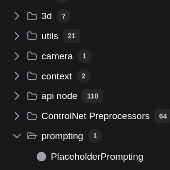
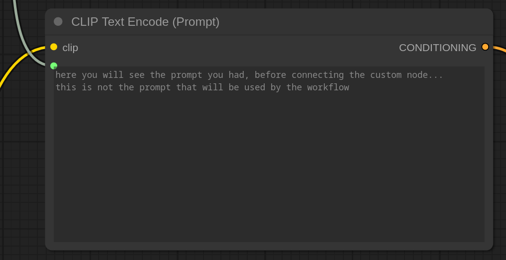
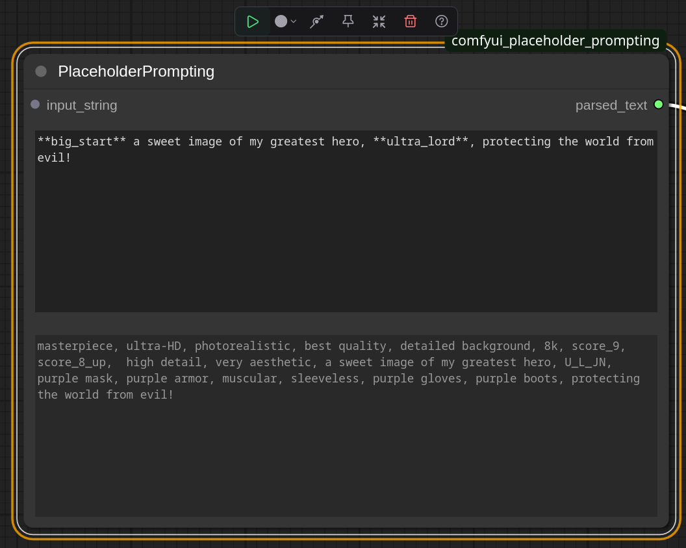

# comfyui_placeholder_prompting

custom node which allows placing \*\*some_tag\*\* in your prompt and it will replace it with a preset prompt as you like.

### **tired of writing large prompts?**
```a large, mainly green couch with plenty of cushions to soothe the heads of many weary men and women. The couch has no eyes but can sense the weight of a human and begins feeding on their life force once the victim is asleep```

You don't need to write this in every prompt where you want a killer couch.

### **do it like this**

```image of a **killer_couch** placed in a garden.```

which will transform into:

```image of a large, mainly green couch with plenty of cushions to soothe the heads of many weary men and women. The couch has no eyes but can sense the weight of a human and begins feeding on their life force once the victim is asleep, placed in a garden.```

in every instance you like, be it garden, living room or town square!

# new in v1.1 - comments/temporarily marking parts of a prompt
You can use ```## .....some text..... ##``` to temporarily exclude a part of your prompt.

### Example
Prompt:
```image of a comfortable couch placed in a livingroom```

If you want to test the same prompt in a garden setting instead, just do:

```image of a comfortable couch placed in a ##livingroom## garden```

The system will then treat the prompt as:
```image of a comfortable couch placed in a garden```\
This way, you keep the original text in your prompt node without deleting it, making it easy to revert back later.

Notes:\
Works with single words, multiple words, and across line breaks.\
You can use it multiple times in one prompt.\
Just make sure you always add and remove ## in pairs.


# installation
Clone this repo into your ```custom_nodes``` folder.
rename the placeholders/placeholders_example.json file to placeholder/placeholders.json
remove or add placeholders in the placeholders.json file as you please (can do anytime)
(re)start ComfyUI

the custom node should now be available under 'prompting' and is called 'easy prompting'



add the node to the workflow and connect to the CLIP node (upper left corner of the input box in the CLIP node)


the textbox in the CLIP node will now grey out and you cannot edit it any more. (don't worry, the text which is still there will not be used)



no reload is required when making changes in the placeholders.json file. this file will be read on every change in the prompt of the custom node when run, so new prompts are created with the latest data.

# usage
usage example (when you left the examples in the placeholders.json):

```**big start** a sweet image of my greatest hero, **ultra_lord** ,protecting the world from evil!```

running the workflow would create the full prompt and show it as:


```masterpiece, ultra-HD, photorealistic, best quality, detailed background, 8k, score_9, score_8_up,  high detail, very aesthetic, a sweet image of my greatest hero, ultra lord, purple mask, purple armor, muscular, sleeveless, purple gloves, purple boots ,protecting the world from evil!```

this text is then fed to the CLIP node and handled as the given prompt.

you can also 'try it' by clicking on the run button on the node only.
this will only trigger the prompt creation and not pass it to the CLIP or run the rest of the workflow. This way you can fine tune your prompt further.



Want to change stuff in the placeholders.json, you can change it there, or when you just want to create an exception for once, copy the prompt that was created into the input box and edit from there...

# adding your own placeholders
in the custom_nodes/comfyui_placeholder_prompting/ folder is a placeholders.json file
(if not, just rename the placeholders_example.json file)
this is a json file, and is a container for so called "key": "value" pairs.
for instance:

```"marci": "marci, bangs, brown hair, brown eyes, ponytail, short ponytail,",```

"marci" is the key and "marci, bangs, brown hair, brown eyes, ponytail, short ponytail," is the value.

when you place: \*\*marci\*\* in your prompt, it will find it as a key in the json file and replace it with the value: "marci, bangs, brown hair, brown eyes, ponytail, short ponytail,"

You can add/edit/remove these pairs as you like.

note that all key-value pairs have a comma at the end, except for the last one, which json does not like.

# FAQ
## why doesnt the CLIP node show the correct prompt?
By using a custom node which feeds into the CLIP node, the functionality of the CLIP node is not altered so any updates on the CLIP node (which is maintained by ComfyUI) will work on your instance as well without conflicting with the custom prompt node.
Since we want this and so we do not want to alter the function of the CLIP node, the CLIP node does what the CLIP node does when it receives it prompt from another node (shows a greyed out prompt with a fixed text).
But... the prompt from the custom node is used.
If you cannot live with the text in the CLIP node and it is greyed out?
remove the edge (line) between the custom node and the clip node, and the CLIP node prompt field is normal again, change it into a text you like and reconnect the custom node to the CLIP node.

## Optional
If you do not want to connect (or cannot connect) to a following node but still want to use generating prompts with placeholders... 
add the custom node as a separate, not connected to the workflow, node, and use it's own 'play' button to generate the prompt and copy paste the output by hand into whatever node you like.